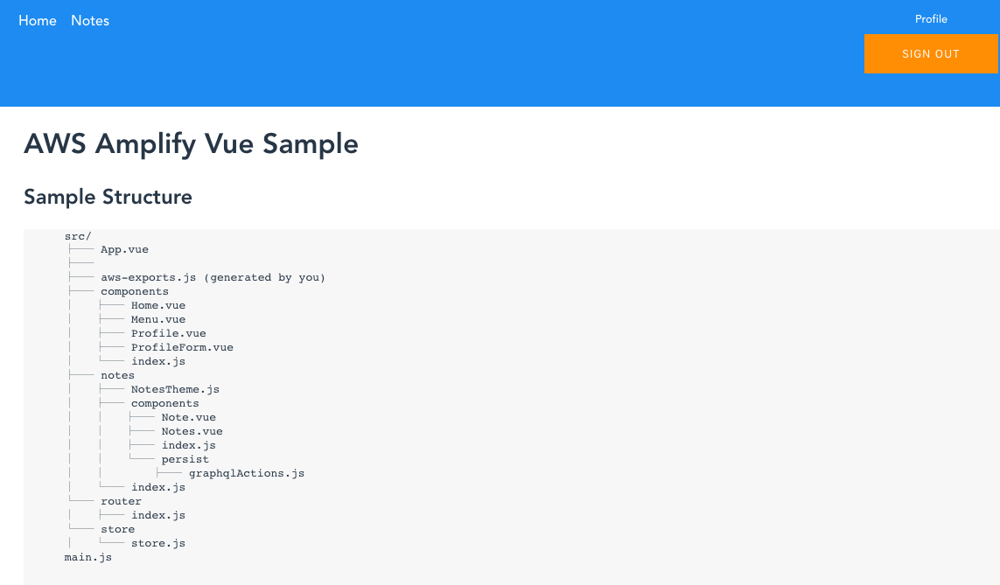

# 바로 시작하기
   
  Amplify Console 배포하고 싶다면, 아래 버튼을 클릭 하세요.

  [](https://console.aws.amazon.com/amplify/home#/deploy?repo=https://github.com/isheejong/awskr-amplify-vue)

  <table><tr><td>
    
  </td></tr><table>

</hr>

## Amplify 명령어

#### amplify init
  
 backend 를 구성할 수 있는  cloud formation root stack 을 생성하며, 3개의 리소를 생성 합니다.
 
  - IAM role : 비 인증된 사용자 롤
  - IAM role : 인증된 사용자 롤
  - S3 bucket : 배포를 위한 버킷 및 프로바이더 워크 플로우에 사용됨 

  - 프로바이더(Priovider): 로컬 개발환경에서 파일 형태로 정의한 백엔드 리소스를 클라우드 환경에서 생성하는 역활을 하는 도구로서 Amplify 는 기본적으로 amplify-provider-awscloudformation 을 사용합니다.
  </br>
  
  **처음 시작하는 프로젝트 (프로젝트 디렉토리에 amplify 디렉토리가 없는 경우)**: 프로바이더는 클라우드에 리소스를 생성하는 과정에서  Root Stack 과 리소스에 대해서 로그를 제공하며, 최종적으로 amplify-meta.json 파일을 생성합니다. 그리고 명령어가 실행된 디렉토리에 amplify 라는 디렉토리가 생성되며, 해당 디렉토리에는 백엔드 리소스에 대한 정보과 저장됩니다. Root Stack은 AWS Cloud Formation Template 로서 /amplify/backend/awscloudformation 디렉로리 생성됩니다.
  <br/>
  
  **이미 amplify 디렉토리가 있는 경우**: amplify 디렉토리가 이미 존재하는 경우 (Git Hub 에서 Code를 Clone 한 경우) 에는 해당 파일을 참고하여, aws-exports.js 와 같이 백엔드와 통합 할 수 있는 리소스를 생성합니다. 이 경우는 amplify 디렉토리에 백엔드에 필요한 리소스가 이미 정의가되어 있으므로, 해당 파일을 참고하여 필요한 파일을 생성합니다. 

  **GitHub 에서 Clone과 동시에 amplify backend 리소스 생성**

  ```   
  $ amplify init --app <github url>
  ```

  위 명령어가 실행된 디렉토리는 비어 있어야 합니다. 또한, git 에 저장되어 있는 애플리케이션의 amplify 디렉토리에는 project-config.json 와 backend-config.json 를 포함하고 있어야 합니다. **amplify init** 은 최초에 amplify 백엔드 리소스를 성성하거나, 또는 이미 생성이 되어 있는 경우 백엔드와 통합하는 리소스를 생성하는데 사용됩니다.
<br/>

#### amplify add \<category\>

위 명령어를 통해서 백엔드에 필요한 리소스를 생성하기 위한 stack 을 생성합니다. 명령어가 실행되면 category 에 해당하는 리소스는 cloudformation stack 가 업데이트 되며, nested cloud formation template 형태 됩니다. amplify/backend/<category> 에 해당 하며, 해당 디렉토리에 nested child stack 이 생성됩니다.  하나의 백엔드를 여러 개발자가 변경할 때는 항상 amplify pull 명령어를 실행하여, backend 를 수정하기 전에 최신의 백엔드 template 을 유지 할 수 있도록 해야 합니다.


#### amplify pull

해당 명령어는 Cloud에 Provisioned 된 리소스를 로컬에 있는 프로젝트에 코드로 내려 받을 수 있습니다. 그래서 AWS Cloud에 Provisioned 리소스와 로컬 파일의 동기화 하는데 사용됩니다.

- initialized 된 프로젝트 인 경우: amplify/#current-cloud-backend 에 최신 상태를 유지 하도록 합니다.
- initialized 된 프로젝트 가 아닌 경우: AWS에 존재하는 backend 환경을 선택하고, 선택된 환경에 대한 백엔드 정보를 파일로 내려 받습니다.

<hr/>

## amplify 디렉토리 및 파일

amplify init 이후에 amplify CLI 를 이용하여 backend 를 구성하는 경우 다음과 같은 디렉토리 구조 및 파일들이 존재한다.

#### amplify/.config
- cloud confiruration 및 사용자 설정 정보등이 저장된다.
- 각 환경별 설정 파일
- 프로젝트 설정

#### amplify/#current-cloud-backend
- 가장 최근에 클라우드에 Provisioned 된 백엔드에 대한 구성
- amplify/backend 
- 현재 로컬에서 작업중인 백엔드에 대한 구성 정보
- https://aws-amplify.github.io/docs/cli-toolchain/usage?sdk=js

#### amplify-meta.json
- 해당 파일은 위 두개의 backend 디렉토리에 위치하며, 현재 targeting  하는
- 백엔드에 대한 정보를 가지고 있다. 백엔드 리소스에 접근하기 위한 메타 정보가 포함되어 있으며,
- amplify add <category> 명령을 통해 생성된 리소스에 대한 정보가 저장되어 있어. 백엔드 구성을 변경하기 위해 통신하는 정보로 활용된다.

#### aws-exports.js
- 해당 파일을 애플리케이션에서 백엔드에 접근 하기 위한 메타 정보가 저장되어 있는 파일이다. 

#### team-provider-info.json
- 팀 멤버간에 백엔드 리소스를 공유해야하는 경우 해당 파일을 사용할 수 있다. **amplify env checkout \<environment\>** 를 통해서 환경을 변경하는 경우,위 파일을 참고해서 해당 하는 백엔드로 변경된다. 자신의 백엔드 환경을 다른 사람과 공유하고 싶은 경우에, 위 파일을 통해 공유 할 수 있다.
  
#### backend-config.json
- 현재 backend 에 구성되어 있는 리소스에 대한 정보를 포함하고 있다.

#### amplify/backend/stacks
- cloudformation stacks 을 위한 cloudformation template resource 를 포함하고 있다. 만약에 backend provisioing 을 customization 을 하고 싶다면, 해당 파일을 수정하면된다. 

#### amplify/backend/build
- backend 에 생생되어야 하는 리소스를 포함하고 있다.lambda function, resolver, pipeline functions, stack 이 포함되어 있다. schema.graphql 을 백엔드에 실제로 생성되는 스키마이다. type mutation, subscrib, query 에 필요한 리소스가 /amplify/backend/schema.graphql 을 기반으로 생성된다.


#### 참고한 링크
>  https://read.acloud.guru/multiple-serverless-environments-with-aws-amplify-344759e1be08
>  https://aws-amplify.github.io/docs/cli-toolchain/quickstart#multiple-frontends 