# 애플리케이션 개발을 위한 준비


Amplify 애플리케이션 개발을 위해 필요한 에디터를 소개 합니다. AWS가 제공 하는 **"Cloud9"** 을 이용하거나 또는 **"Visual Studio Code"** 을 이용할 수 있습니다. 프론트 엔드(Frontend) 프레임 워크로 **Vue** 를 사용할 예정이며, 이에 필요한 CLI 설치합니다. 또한 **Amplify CLI** 설치하여 Amplify Console에 배포에 방법을 정리하였습니다.

<hr/>

## Cloud9 IDE 환경 
AWS 에서 제공하는 Cloud9 IDE를 생성하고 접속합니다.

1. AWS 계정에 로그인 한 다음, Cloud9 서비스를 선택 합니다.
    <table><tr><td>
    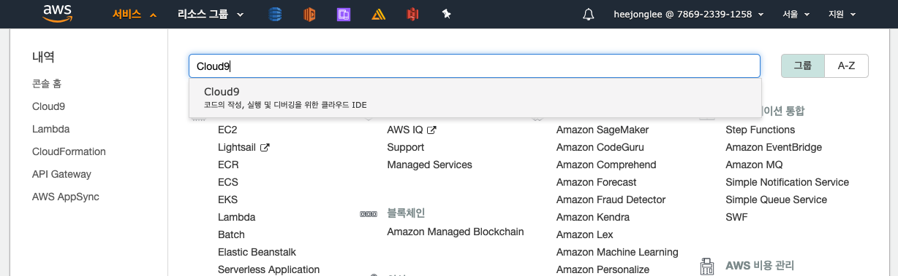
    </td></tr><table>

2. **[Create environment]** 버튼을 선택합니다.
    <table><tr><td>
    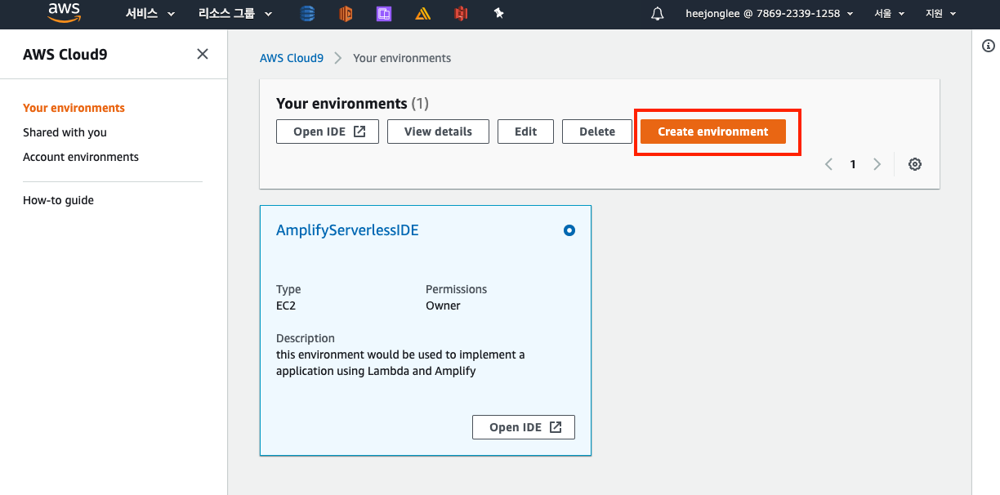</td></tr><table>

3. **Environment** 이름과 설명을 입력하고, **[Next Step]** 을 선택합니다.
   <table><tr><td>
   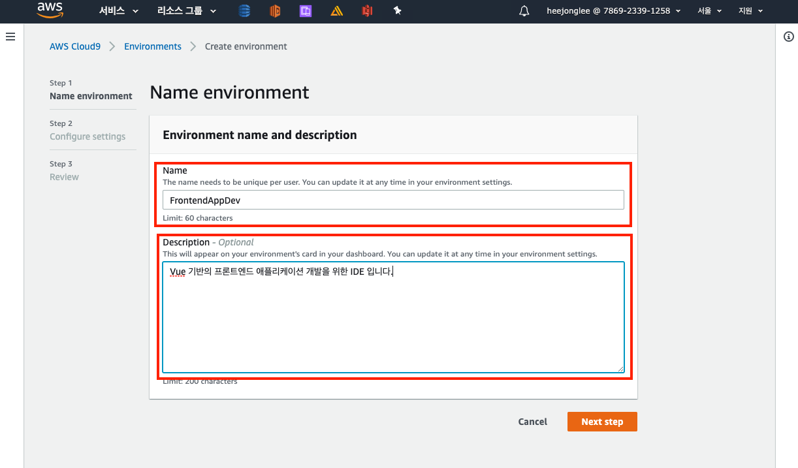
   </td></tr><table>

4. AWS 클라우드 콘솔에 로그인하고 Cloud9 서비스 페이지로 이동하여 아래와 스펙과 동일하게 Cloud9 IDE 인스턴스를 생성합니다.
    <table><tr><td>
    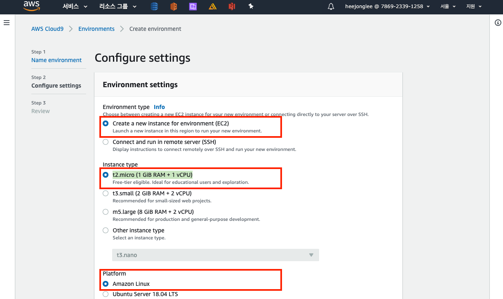</kbd>
    </td></tr><table>

    - EC2 instance type : t2.micro
    - Memory : 1GB
    - CPU : 1vCPU
    - Platform : ubuntu 18
 
5. 생성된 Cloud9 IDE 인스턴스에 접속합니다.

Cloud9에 대한 상세한 설명은 <a href="https://docs.aws.amazon.com/ko_kr/cloud9/latest/user-guide/welcome.html" arget="_blank">여기</a>를 참고하세요.

<hr/>

## Visual Code 를 이용한 개발 환경

1. Visual Studio Code 를 로컬 피씨의 환경에 맞게 다운로드 하고 설치하고 실행합니다.
   
    <a href="https://code.visualstudio.com/download" arget="_blank">다운로드 페이지</a>

    <table><tr><td>
    
    </td></tr><table>

    
    <table><tr><td>
    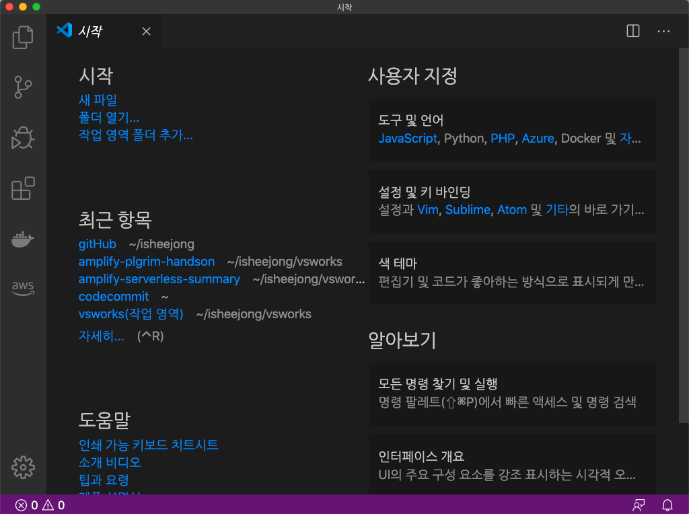
    </td></tr><table>

2. **시작** 탭을 닫고 **[폴더열기]** 를 선택합니다.
   
   <table><tr><td>
   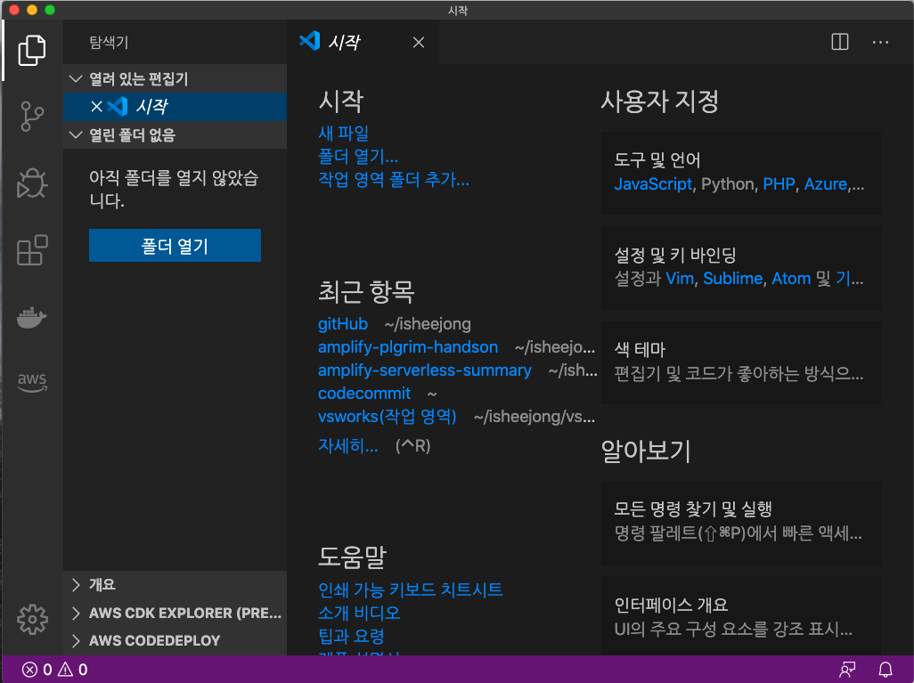
   </td></tr><table>


3. 개발을 위한 디렉토리를 선택합니다.

   <table><tr><td> 
   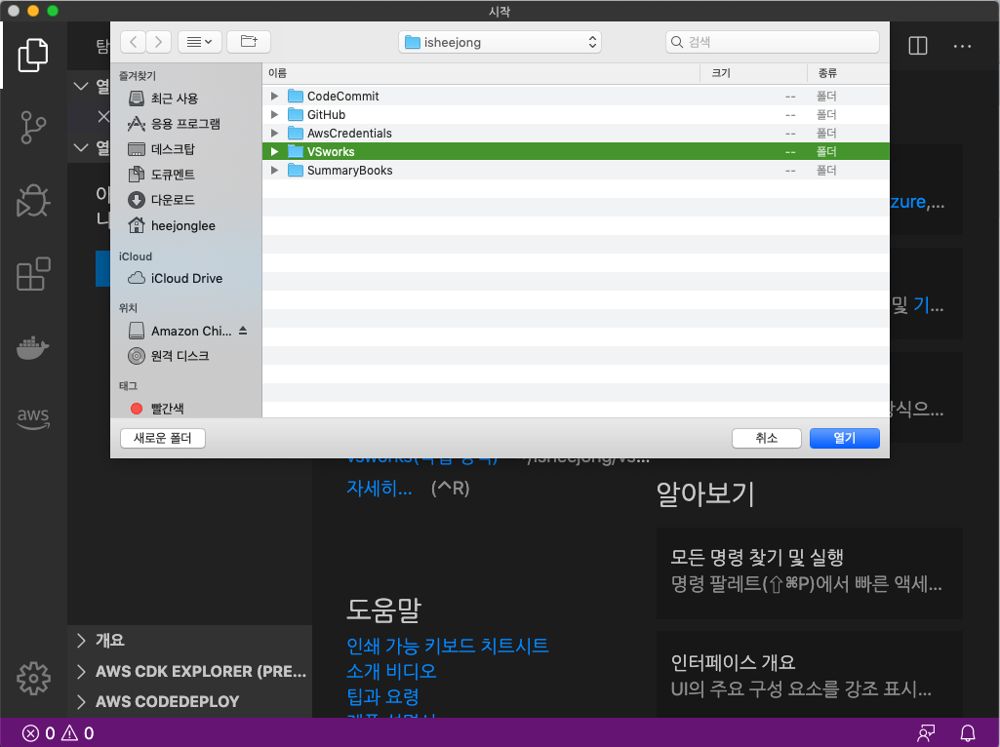
   </td></tr><table>


<hr/>

## Vue 프로젝트 만들어 보기

Vue 는 프론트 엔드 프레임 워크로 많은 개발자들에게 주목을 받고 있는 프레임워크 중에 하나입니다. Vue 프레임 워크를 이용하여 애플리케이션
개발을 진행하기 위해서는 Cloud9 또는 Local PC 환경에서 NodeJs와 NPM이 설치 되어 있습니다. 설치 되어 있지 않다면 아래 링크를 통해 해당하는 OS 환경에 맞는 버전으로 설치 하시기 바랍니다.

<a href="https://nodejs.org/ko/download/" arget="_blank">NodeJS, NPM 설치 페이지 이동</a>

NodeJs는 향후 Webpack 을 이용하여, 프론트 엔드 애플리케이션을 개발하고 빌드 하기 위해 사용되고, NPM은 애플리케이션 개발 및 빌드에 필요한
모듈을 다운로드 합니다. 두개 설치가 된 이후에 아래를 진행 할 수 있습니다.

1. 다음으로 Vue 프로젝트를 손쉽게 생성하기 위해, vue CLI(Command Line Interface)를 설치합니다. (설치 명령어는 아래 참고)

    ```
    heejonglee:~/environment $ npm install -g @vue/cli
    ```

    > -g 옵션은 global 으로 설치되며, 모든 디렉토리에서 설치된 명령어를 사용할 수 있습니다.

2. 설치된 vue 명령어를 이용하여, 프로젝트를 생성합니다. 설치 옵션으로 Vuex 와 Router 를 선택합니다.

    ```
    heejonglee:~/environment $ vue create forntend-store 
    ```


    > Cloud9 환경에서 webpack 으로 애플리케이션을 빌드하고 페이지에 접근 하는 경우,  Invalid Header 오류가 발생 합니다. 해당 문제를 해결하기 위해서 package.json 디렉토리와 동일 한 위치에 vue.config.js 파일을 생성하고 disableHostCheck 를 false 로 설정하면, 문제를 해결 할 수 있습니다.


    ```
    module.exports = {
        devServer: {
            disableHostCheck: true
        },
    // ... other options
    }
    // In order to disable the hostcheck
    ```

3. 다음과 같이 명령어를 실행하여, vue application 이 정상적으로 실행되는지 확인합니다. **"Visual Studio Code"** 환경인 경우 웹 브라우저를 열고 http://localhost:8080 을 접속 하면 되며, **"Cloud9'** 환경에서는 **[Preview Application]** 을 통해서 동작하는 애플리케이션을 확인합니다.

    ```
    heejonglee:~/environment $ npm run serve 
    ```

<hr/>

## Amplify 프로젝트 적용하기

1. amplify 애플리케이션 개발에 필요한 Amplify CLI(Command Line Interface)를 설치 합니다.
    ```
    heejonglee:~/environment $ npm install -g @aws-amplify/cli
    
    ..(생략)..

    heejonglee:~/environment $ amplify -v
    Scanning for plugins...
    Plugin scan successful
    4.13.4
    heejonglee:~/environment 
    ```

2. Amplify CLI 에서 사용하기 위한 aws profile 설정한다. 참고로, accessKeyId와 secretAccessKey는 ~/.aws/credential 디렉토리에서 확인 할 수 있습니다.

    ```    
    frontend-store (master) $ amplify configure
    Follow these steps to set up access to your AWS account:
    
    Sign in to your AWS administrator account:
    https://console.aws.amazon.com/
    Press Enter to continue
    
    Specify the AWS Region
    ? region:  ap-northeast-2
    Specify the username of the new IAM user:
    ? user name:  heejonglee
    Complete the user creation using the AWS console
    https://console.aws.amazon.com/iam/home?region=undefined#/users$new?step=final&accessKey&userNames=heejonglee&permissionType=policies&policies=arn:aws:iam::aws:policy%2FAdministratorAccess
    Press Enter to continue
    
    Enter the access key of the newly created user:
    ? accessKeyId:  AKIA3OOCKB**********
    ? secretAccessKey:  i1asijPXEpyYUpB/Tkva********************
    This would update/create the AWS Profile in your local machine
    ? Profile Name:  amplify
    
    * 참고: https://github.com/aws-samples/amplify-photo-gallery-workshop/issues/3
     ```
 
3. 프로젝트 디렉토리로 이동하고, amplify init 을 통해 amplify 애플리케이션 필요한 환경을 구성합니다.
    ```
    heejonglee:~/environment $ cd aws-serverless-ecommerce-front-store 
    heejonglee:~/environment/aws-serverless-ecommerce-front-store (master) $ amplify init
    Note: It is recommended to run this command from the root of your app directory
    ? Enter a name for the project frontend-store
    ? Enter a name for the environment dev
    ? Choose your default editor: None
    ? Choose the type of app that you're building javascript
    Please tell us about your project
    ? What javascript framework are you using vue
    ? Source Directory Path:  src
    ? Distribution Directory Path: dist
    ? Build Command:  npm run-script build
    ? Start Command: npm run-script serve
    Using default provider  awscloudformation
    
    For more information on AWS Profiles, see:
    https://docs.aws.amazon.com/cli/latest/userguide/cli-multiple-profiles.html
    
    ? Do you want to use an AWS profile? Yes
    ? Please choose the profile you want to use amplify
    Adding backend environment dev to AWS Amplify Console app: db1daurslfdzj
    ⠦ Initializing project in the cloud...
    
    CREATE_IN_PROGRESS amplify-frontend-store-dev-40048 AWS::CloudFormation::Stack Tue Feb 25 2020 04:00:49 GMT+0000 (Coordinated Universal Time) User Initiated    >         
    CREATE_IN_PROGRESS UnauthRole                       AWS::IAM::Role             Tue Feb 25 2020 04:00:52 GMT+0000 (Coordinated Universal Time)                            
    CREATE_IN_PROGRESS AuthRole                         AWS::IAM::Role             Tue Feb 25 2020 04:00:52 GMT+0000 (Coordinated Universal Time)                            
    CREATE_IN_PROGRESS DeploymentBucket                 AWS::S3::Bucket            Tue Feb 25 2020 04:00:53 GMT+0000 (Coordinated Universal Time)                            
    CREATE_IN_PROGRESS UnauthRole                       AWS::IAM::Role             Tue Feb 25 2020 04:00:53 GMT+0000 (Coordinated Universal Time) Resource creation Initiated
    CREATE_IN_PROGRESS DeploymentBucket                 AWS::S3::Bucket            Tue Feb 25 2020 04:00:54 GMT+0000 (Coordinated Universal Time) Resource creation Initiated
    CREATE_IN_PROGRESS AuthRole                         AWS::IAM::Role             Tue Feb 25 2020 04:00:54 GMT+0000 (Coordinated Universal Time) Resource creation Initiated
    ⠴ Initializing project in the cloud...
    
    CREATE_COMPLETE UnauthRole AWS::IAM::Role Tue Feb 25 2020 04:01:10 GMT+0000 (Coordinated Universal Time) 
    CREATE_COMPLETE AuthRole   AWS::IAM::Role Tue Feb 25 2020 04:01:11 GMT+0000 (Coordinated Universal Time) 
    ⠧ Initializing project in the cloud...
    
    CREATE_COMPLETE DeploymentBucket                 AWS::S3::Bucket            Tue Feb 25 2020 04:01:15 GMT+0000 (Coordinated Universal Time) 
    CREATE_COMPLETE amplify-frontend-store-dev-40048 AWS::CloudFormation::Stack Tue Feb 25 2020 04:01:18 GMT+0000 (Coordinated Universal Time) 
    ✔ Successfully created initial AWS cloud resources for deployments.
    ✔ Initialized provider successfully.
    Initialized your environment successfully.
    
    Your project has been successfully initialized and connected to the cloud!
    
    Some next steps:
    "amplify status" will show you what you've added already and if it's locally configured or deployed
    "amplify add <category>" will allow you to add features like user login or a backend API
    "amplify push" will build all your local backend resources and provision it in the cloud
    “amplify console” to open the Amplify Console and view your project status
    "amplify publish" will build all your local backend and frontend resources (if you have hosting category added) and provision it in the cloud
    
    Pro tip:
    Try "amplify add api" to create a backend API and then "amplify publish" to deploy everything
    
    heejonglee:~/environment/aws-serverless-ecommerce-front-store/frontend-store (master) $ 
    ```

4. AWS 클라우드 콘솔의 클라우드포메이션에서 congito 를 사용하는 Role 및 애플리케이션 배포에 필요한 S3 버킷이 생성된 것을 볼 수 있습니다.

    ```
    AuthRole : cognito role
    DeploymentBucket : deploymnent s3 bucket
    UnauthRole : cognito role
    ```
 
<hr/>

## CodeCommit을 통한 코드 버전 관리

1. CodeCommit 을 통해서 소스코드의 버전관리를 하기 위해서는 현재 로그인한 계정에 다음 2개의 권한이 있어야 합니다. 해당 권한이 존재 하지 않으면, **AWS CodeCommit에 대한 HTTPS Git 자격 증명** 에서 CodeCommit에 대한 HTTP Git 자격증명을 생성하거나 삭제 할 수 없습니다. 
   
   - CreateServiceSpecificCredential
   - DeleteServiceSpecificCredential
   - ResetServiceSpecificCredential

2. **IAM** 서비스로 이동하여 **사용자** 메뉴 화면에서 조회된 로그인한 사용자의 사용자 이름을 선택합니다. 그 다음 보안 자격증명 탭으로 이동 합니다. 
   
    <table><tr><td>
    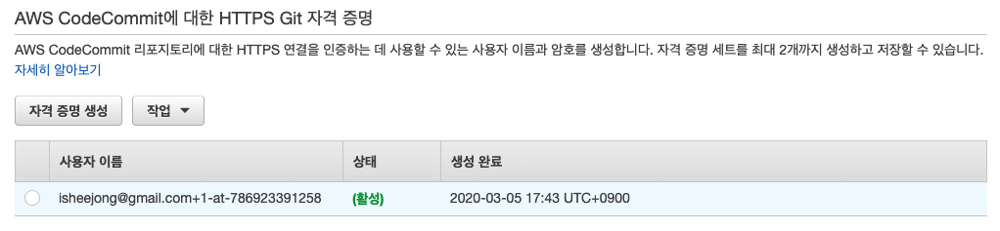
    </td></tr><table>

3. **[자격 증명 생성]** 을 선택하여 CodeCommit에 대한 HTTP Git 자격증명을 생성합니다. **[자격 증명 다운로드]** 선택하여 생성된 자격증명(사용자 이름 및 패스워드)을 다운로드 합니다.
    <table><tr><td>
    
    </tr></td></table>

4. 다음으로 CodeCommit 페이지로 이동하여, 코드의 버전을 관리하기 위한 Repository 를 생성한다.

    <table><tr><td>
    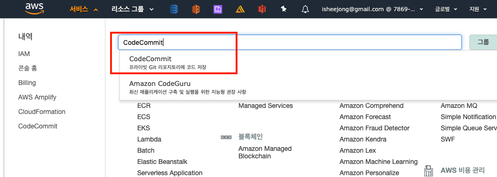
    </tr></td></table>

    <table><tr><td>
    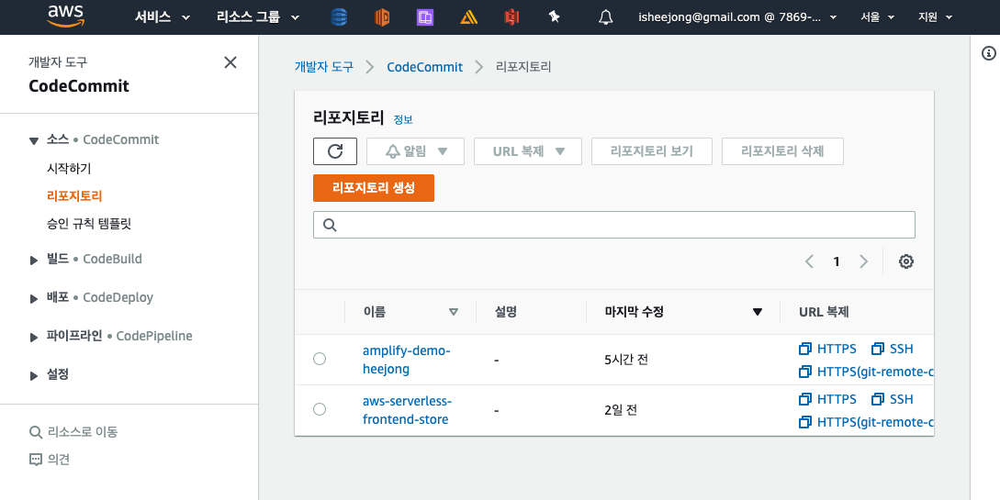
    </tr></td></table>

    <table><tr><td>
    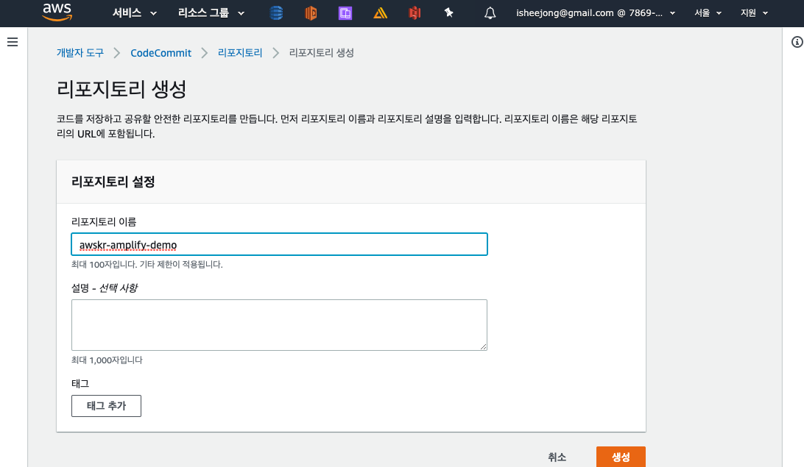
    </tr></td></table>

    <table><tr><td>
    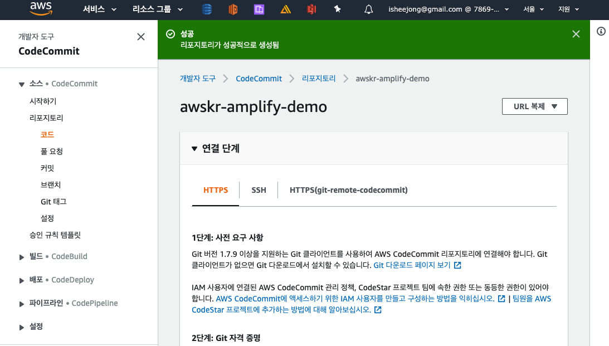
    </tr></td></table>

5. 지금까지 작업 된 애플리케이션 소스코드를 Git Repository 에 Push 한다.push to git repository

    ```
    heejonglee:~/environment/aws-serverless-ecommerce-front-store/ $ git add .
    heejonglee:~/environment/aws-serverless-ecommerce-front-store/ $ git commit -m "first a commit"
    heejonglee:~/environment/aws-serverless-ecommerce-front-store/ $ git remote add origin https://git-codecommit.ap-northeast-2.amazonaws.com/v1/repos/aws-retail-demo
    heejonglee:~/environment/aws-serverless-ecommerce-front-store/ $ git push -u origin master
    ```

## Amplify 기반의 개발을 하기 위한 IAM Polciy 

Amplify 기반의 애플리케이션을 개발하기 위해 클라우드 사용자 계정이 소유해야 하는 Role 에 대한 Policy 입니다. 
   <a href="../etc/amplifyUserPolicy" target="_blank">다운로드</a>